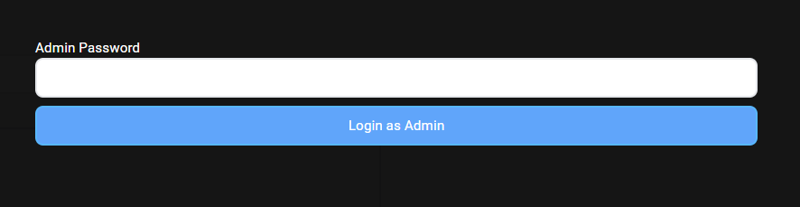

# GJokes

This Project is a nice simple Website. This site allows you hear funny jokes.

## Table of Contents
### 1. [What was our motivation?](#what-was-our-motivation)
### 2. [What are the features of our Project?](#what-are-the-features-of-our-project)
### 3. [Why is our Project currently not hosted on a Webserver?](#why-is-our-project-currently-not-hosted-on-a-webserver)
### 4. [How to install the Application?](#how-to-install-the-application)
### 6. [Known limitations](#known-limitations)
### 7. [What did we learn?](#what-did-we-learn)
### 8. [What tools were used?](#what-tools-were-used)

# What was our motivation?

First of all, our motivation was school. It was a school project. Our task was to create an CRUD application. We had the freedom to choose the technology we wanted to use.
Because we wanted to learn new skills, we decided to use technologies, which were new to us. So, our Motivation was school and our greed for knowledge.

## What are the features of our Project?

Our Project allows you to hear jokes. The jokes are brought to you in a very special way. We upload this Jokes to a special  Github Repository. The commits are not done in our name, but in yours.

The jokes are delivered every Day at 12:00. Unfortunately, the Jokes count to your Github Contribution graph. 

### __User Feature list:__ 

### 1. Register and Login
<p align="center">

Register             |  Email Verification| Login
:-------------------------:|:-------------------------:|:-------------------------:
  |   |  

</p>

The User is able to create an account and login. 
When the User is creating an Account, an Email verification token is send. This Code has to be entered in the right field

The Email looks like this:
<p align="center">
    
</p>

### 2. After User is logged in, he can configure his Github Settings.

<p align="center">
    
</p>

This includes his Github Username, his Github E-Mail and the name of the Github Repository the Jokes are uploaded to. The Username and Email are needed to upload the Jokes is your name. 

After the changes have been done, the Save Changes Button can be clicked. 

If the User is currently not in the Repository, he can send an invite to the Repository, via the "Send Github Invite" Button. The Invite is sent to configured Github Username

### 3. Configure the Jokes 
<p align="center">
    
</p>
Under the Jokes Settings section can the user configure the Number of Jokes he want each day. 

The Random range is there, to preserve som randomness and a specific surprise factor.

The changes aren't saved until the "Save Changes" Button is pressed.

### 4. Account Settings
<p align="center">
    
</p>
The User is able to change his password and delete his account. 

If the Account is deleted, the Users generated Jokes stay in the Repository. The Access is still guaranteed and his Github statistic doesn't change. The only thing that changes is, that there are no new Jokes and the User can't login anymore.

### 5. Generate Jokes now

<p align="center">
    
</p>

If the User don't want to wait, he can generate Jokes now. The has to enter the number of Jokes he wants to generate and press the Generate Button. 

### 6. Generate Jokes in the Past

<p align="center">
    
</p>

If the User want's Jokes in the Past, he can do this. He has to enter the date range where he wants the jokes and the Joke range and press the Generate Button.

### __Admin Feature list:__ 
There are some Admin functionalities. In order to use them, the AdminPassword is needed.

(
    If you take a look at the logic behind the admin functionalities, you will see some major security issues. We have to say, in our defense, that this Part of the project was not planed. We needed to implement this part to fullfil the Project requirements.
)

1. Admin Login

<p align="center">
    
</p>

2. View all Users
 <p align="center">
    
</p>  

The Admin can view all registered Users. On each page are 30 Users shown. but the admin can load more, via the load more button.

 <p align="center">
    
</p>  

 <p align="center">

Filterby             |  Orderby| Search
:-------------------------:|:-------------------------:|:-------------------------:
  |   |  
</p>

The Search algorithm uses the levinstein distance to order the Users Email by there similarity to the entered search Mail. 
This is good, because if the mail not known completely the User can still be found.

3. View User Infos of one specific User
<p align="center">
    
</p>  

The admin can get further information about a User with a click on hist name. He can then see if the is blocked, if he is verified, hit configuration and many more informations. 

The admin can also block the user right there. With a click on the Block button.

A blocked User can't login anymore and no jokes are generated for him. The only way to be unblocked is by an Admin.

<p align="center">
    
</p>  

## Why is our Project currently not hosted on a Webserver?

The reason for that is pritty simple, we have no money. It costs us a lot of money to an ASP.Net backend and we are still students with no money:(
So, if you want to use our project, you have to host it on your own.

## How to install the Application?
1. Install Git, Node and .Net 6
- Git: https://git-scm.com/book/de/v2/Erste-Schritte-Git-installieren
- Node: https://nodejs.org/en/download/
- .Net6: https://dotnet.microsoft.com/en-us/download/dotnet/6.0
2. Clone the repository
```console
git clone https://github.com/Maxi1324/GJokes
```
2. Install all the Node packages
```console
//change to the /GJokes/Frontend folder
npm install
```
3. Start the Frontend:
```console	
// change to the /GJokes/Frontend folder
npm start
```
5. Setup the Config.cs File

We know, that there are dozens of ways for doing this better, but we ran out of time and this is just a school project. That's why the Settings are in the __GJokes/Backend/GJokes/Config.cs__ File


There are a few fields needed to change:
- MailPassword: The Password for the EMail
- Mail: Email
- GToken: The Github security token for the Github Account of the Application
- GAccountName: The Name of the Github Profile of the Application
- AdminPassword: The Password for the Admin
- key: The secret for the JWT Tokens

6. Setup the Github CLI:

There are many functionalities, which uses the Github CLI. The only thing, that needs to be done is the login process. So enter the following command and follow the instructions.

```console :
// change to the /GJokes/Backend/GJokes folder
.\gh.exe auth login
```

7. Start the Backend:
```console
// change to the /GJokes/Backend/GJokes folder
dotnet.exe run
```

## Known limitations
- Currently does the application only run on Windows.
- There are some Security voluntaries.
- The Configurations is saved in a .cs File.
## What did we learn?

- Angular
- ASP.NET
- Teamwork and Communication
- Github as a Projektmanagement tool
- Typescript

## What tools were used?
- Angular
- ASP.Net
- c#
- typescript
- Entity Framework
- Git
- Github CLI
- Github as a Projektmanagement tool
- Visual Studio Code
- Visual Studio 2022 Enterprise

<br>
<br>
By the way the used Github Account(Dingsi1) is not one of the Team members, so the Tearms of Confition of Github are not violated. 